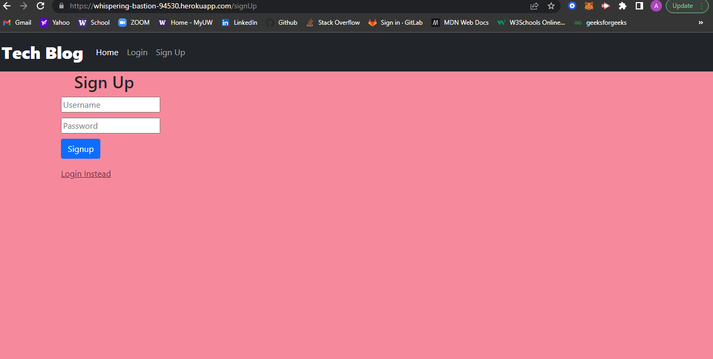

# Tech Blog (MVC)

### Description
this app contains many different files, database storage, and technologies to create a Tech Blog. A user can view previous posts and create a new blog. It will show tha username that the user provides and all the posts that were posted by other users.

If a new user would like to create their own post then they can click the sin up button and create a new user! After they have signed up they will have to log in to post their own or comment on other posts that are seen from the dashboard. 

The user then can logout and their session will end.

### Installation

The packages included:
* `bcrypt`
* `connect-session-sequelize`
* `dotenv`
* `express`
* `express-handlebars`
* `express-session`
* `mysql2`
* `sequelize`

You will then create a database and seed that data.

### Usage
Here is a link to [Tech Blog](https://whispering-bastion-94530.herokuapp.com/)

You must sign up with a username with a number in it

### Github link
[Github](https://github.com/alyesp/tech-squad)